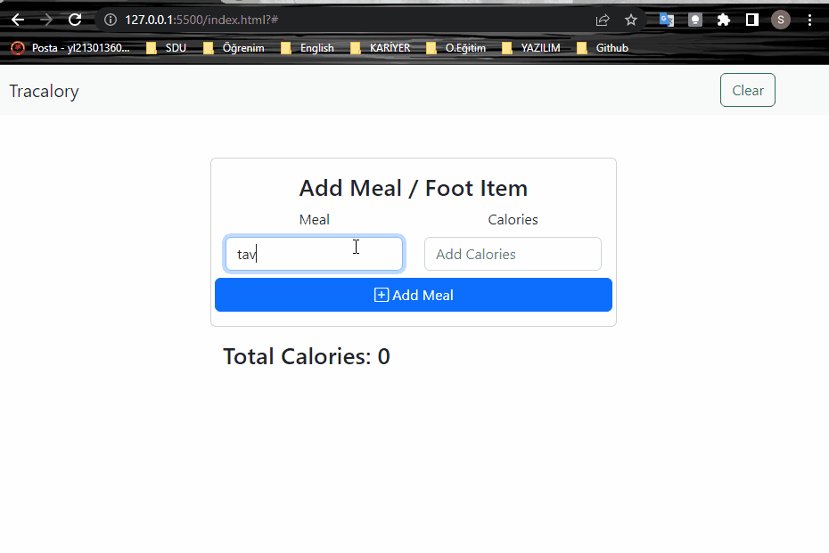

# Tracalory Project
---
In this project, a meal can be added with its' calculated total calorie and shown on the screen. It can also be saved to local storage so that even if the page is reloaded, we can still see the results. If we want to clear all results with local storage, we can use the top-right clear button. These all were made using pure Javascript with the module pattern.

 